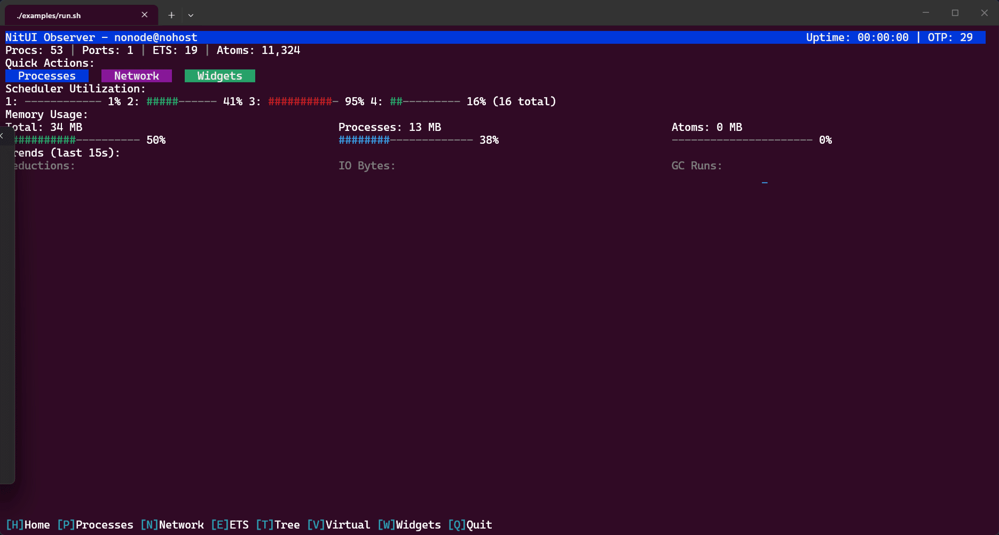

# NitUI

A Nitrogen-inspired terminal UI framework for Erlang/OTP.

## Demo



## Features

- **Declarative UI** — build views with nested element records (`#box{}`, `#table{}`, `#tabs{}`, `#list{}`, `#tree{}`, `#scroll{}`, `#input{}`, `#button{}`, `#modal{}`, etc.)
- **Focus management** — container/child navigation with Tab, Arrow, and Page keys
- **Mouse support** — click and scroll wheel via SGR extended mode
- **Virtual scrolling** — tables with row providers for large datasets
- **Differential rendering** — only redraws changed cells for efficient updates
- **ANSI styling** — fg, bg, bold, dim, underline, italic
- **Unicode** — wide-character and emoji support
- **Terminal resize** — automatic SIGWINCH handling
- **Multi-view navigation** — push/pop view stack for screen transitions

## Quick start

```sh
rebar3 compile
cd examples
./run.sh
```

## Learn more

### Local Observer integration changes

This branch adds support for data-driven live tables and explicit terminal
ownership. Existing widget defaults are preserved.

- `#table.row_keys`: unique keys parallel to rows preserve selection by identity
  through refresh/reordering. In virtual mode provide keys for absolute rows.
- `#table.controlled = true`: the application owns selection, scroll and sort on
  rebuild; NitUI navigation still emits row-selection/activation events.
- `header_separator`, `header_style` and `column_separator` allow compact table
  headers and dense layouts without application-side ANSI rendering.
- Async updates and nested tab/scroll rebuilds preserve widget state recursively.
  Anonymous layout records do not shadow activation of a focused named table.
- `nit_tty:cleanup/0` synchronously stops input, drains reset sequences and
  restores terminal mode. It is idempotent, returns `ok` or
  `{error, cleanup_failed}`, and ends that terminal session (later writes are
  ignored). Normal `nit_server` shutdown invokes it; launchers can invoke it as
  a fallback after a UI crash, before stopping their owned NitUI application.

Use an exclusive OTP 29+ VM with `-noshell -noinput +Bc` for standalone terminal
ownership. Do not take over an existing Erlang shell's reader. The local Observer
integration's Linux PTY suite also tests normal/Ctrl-C/crash cleanup; `rebar3 eunit`
here exercises merge, selection, rendering, activation and cleanup regressions.

- [Documentation](docs/README.md)
- [Demo guide](examples/README.md)
- [Design notes](nitui.md)

## Requirements

- Erlang/OTP 29+ (uses `prim_tty` for raw terminal access and `io_ansi` for terminal control)
- A terminal emulator with ANSI and SGR mouse support
