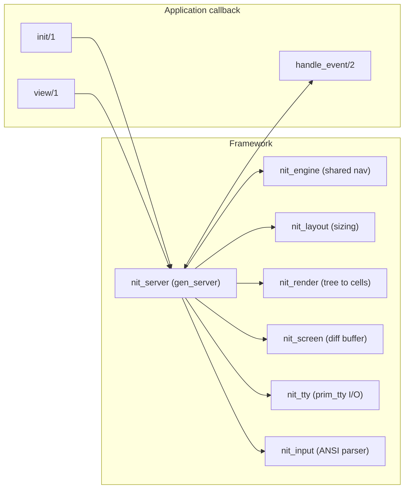

# Architecture

NitUI is retained mode and event driven, in the Nitrogen tradition: the
application declares a tree, the framework keeps it and owns layout, rendering,
input dispatch and focus.



## The event cycle

1. `nit_tty` reads raw bytes from the terminal via `prim_tty`.
2. `nit_input` parses ANSI sequences into events — `{key, up}`,
   `{mouse, click, left, Col, Row}`, `{char, $q}`, and so on.
3. `nit_server` routes the event. Focus movement, widget navigation and text
   editing are handled internally; anything left over is forwarded to
   `handle_event/2` as `{event, RawEvent}`.
4. The callback returns new state or a navigation instruction.
5. `nit_server` calls `view/1`, merges the previous widget state into the new
   tree, resolves layout, renders to a cell buffer, diffs against the previous
   frame and writes only the changed cells.

Steps 4 and 5 are the reason `view/1` must be pure: it is called on every
state change, and twice on entry to a view.

## Module map

### API

| Module | Role |
|--------|------|
| `nitui` | Public API: start/stop, `selected_item/1,2,3`, `copy_to_clipboard/1` |
| `nit_callback` | The behaviour, plus the event and result types |
| `nit_element` | Element behaviour (`render/3`, `height/2`, `width/2`, `fixed_width/1`) and `children/1` |

### Runtime

| Module | Role |
|--------|------|
| `nit_server` | The UI `gen_server`: event loop, view stack, modals, fullscreen, timers |
| `nit_engine` | Shared navigation, pagination, focus resolution and input application |
| `nit_focus` | Focus tree traversal: containers and children |
| `nit_nav` | Table and list navigation with scroll offsets |
| `nit_tree_nav` | Tree navigation, expansion and reveal |
| `nit_hit` | Mouse hit testing |
| `nit_layout` | Height/width resolution and flex distribution |
| `nit_bounds` | Resolving an element id to its rendered `#bounds{}` |
| `nit_tree` | Element tree updates by id |

### Rendering

| Module | Role |
|--------|------|
| `nit_render` | Element tree to cell output, including focus decoration |
| `nit_screen` | Cell buffer and frame diffing |
| `nit_terminal` | OTP 29 terminal backend over `io_ansi`; style and capability facade |
| `nit_ansi` | Compatibility helpers over `nit_terminal` |

### Terminal

| Module | Role |
|--------|------|
| `nit_tty` | TTY owner: raw mode, alternate screen, writes, synchronous cleanup |
| `nit_input` | ANSI key and SGR mouse parser |
| `nit_sighandler` | `gen_event` handler for SIGWINCH |

### Helpers

| Module | Role |
|--------|------|
| `nit_shortcuts` | Shortcut parsing, matching and declarative dispatch |
| `nit_format` | `commas/1`, `bytes/1`, `duration/1` |
| `nit_unicode` | Display width, truncation, wide-character detection |
| `nit_clipboard` | OSC 52 encoding and writing |

### Elements

One module per record in `src/elements/`: `nit_el_box`, `nit_el_button`,
`nit_el_hbox`, `nit_el_header`, `nit_el_input`, `nit_el_list`, `nit_el_modal`,
`nit_el_panel`, `nit_el_progress_bar`, `nit_el_scroll`, `nit_el_spacer`,
`nit_el_sparkline`, `nit_el_stat_row`, `nit_el_status_bar`, `nit_el_table`,
`nit_el_tabs`, `nit_el_text`, `nit_el_text_view`, `nit_el_tree`,
`nit_el_vbox`.

Each implements the `nit_element` callbacks. State preservation across
rebuilds is driven centrally by `nit_tree:merge_state/2,3`; `nit_el_text_view`
additionally exports its own `merge/2` for cursor, selection and copy status.

## Design decisions

**Retained mode, not immediate mode.** The framework keeps the tree between
frames, which is what makes selection, scroll position and cursor state
survive a rebuild without the application tracking them.

**State merging by id.** Widget state is merged from the old tree into the new
one, keyed by element `id`. Stable ids are therefore load-bearing; generated
ids lose focus and selection on every render. `controlled = true` and
`row_keys` exist for applications that want a different policy.

**No fallbacks.** OTP 29's `prim_tty` and `io_ansi` are required, and there is
no termcap or `io:format` path. A single backend keeps the rendering and
cleanup behaviour predictable.

**Explicit focus.** Nothing is focusable unless the application says so, so
adding a widget never reorders an existing Tab sequence by accident.

**Diff rendering.** Only changed cells are written, which is what makes a
one-second full-screen refresh cheap enough to be the default.

## Project layout

```
src/                Framework runtime
src/elements/       One module per element record
include/            nit_elements.hrl (public records)
guides/             These documentation pages
test/               EUnit suite
examples/           Demo application and run.sh
```

```sh
rebar3 compile
rebar3 eunit
rebar3 ex_doc
```
