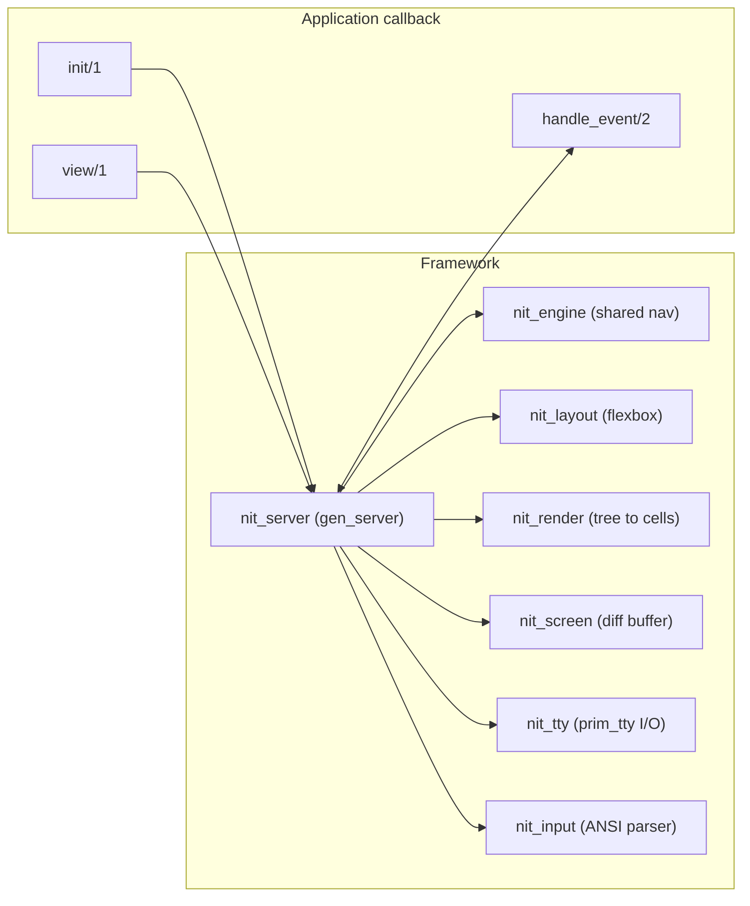

# NitUI: Design Notes

**Architecture:** Retained mode, event-driven (Nitrogen-inspired).
**Runtime:** Erlang/OTP 27+ `prim_tty` (raw mode).

---

## Architecture Overview

NitUI follows a retained-mode architecture where the application declares a UI tree
and the framework handles layout, rendering, input dispatch, and focus management.



### Event cycle

1. `nit_tty` reads raw bytes from the terminal via `prim_tty`
2. `nit_input` parses ANSI sequences into events (`{key, up}`, `{mouse, ...}`, etc.)
3. `nit_server` dispatches the event — navigation is handled internally,
   application events are forwarded to the callback's `handle_event/2`
4. The callback returns a response (`noreply`, `update_state`, `push_view`, etc.)
5. `nit_server` rebuilds the view tree, runs layout, diffs the screen, and writes changes

### Focus model

- **Containers** hold focusable children. Tab/Shift+Tab cycles between containers.
- **Children** within a container are navigated with arrow keys.
- Elements like `#table{}`, `#list{}`, `#tree{}` handle their own internal navigation.

---

## Element Records

All elements share a common base (id, position, size, style, visibility).

### Layout containers

| Record | Description |
|--------|-------------|
| `#box{}` | General container with children |
| `#vbox{}` | Vertical stack |
| `#hbox{}` | Horizontal stack with optional spacing |
| `#panel{}` | Bordered container with optional title |
| `#scroll{}` | Scrollable container with offset tracking |
| `#tabs{}` | Tab switcher with per-tab content |
| `#modal{}` | Overlay dialog |

### Content elements

| Record | Description |
|--------|-------------|
| `#text{}` | Static or styled text; set `wrap = true` to wrap at the allocated render width |
| `#button{}` | Clickable button with optional shortcut key |
| `#input{}` | Text input field with cursor |
| `#table{}` | Data grid with headers, virtual scrolling, row providers |
| `#list{}` | Selectable item list |
| `#tree{}` | Expandable/collapsible tree |
| `#sparkline{}` | Braille-based line chart |
| `#progress{}` | Progress bar |
| `#separator{}` | Horizontal rule |

### Sizing and layout notes

- `width` / `height` accept `auto` (fit content), `fill` (consume remaining
  space), or a positive integer.
- Flexible elements report their height as `{flex, Min}` where `Min` is the
  minimum cells required. `nit_layout` resolves these against available space
  before rendering; summing raw heights yourself will crash on a flex child.
- `#box{}` with `border = none` passes bounds through to its children
  unchanged. With any other border value, children are rendered (and
  hit-tested) inside a one-cell inset on every side.
- `#hbox{}` measures wrapped text against the width each child actually
  receives, not the parent width — so `#text{wrap = true}` reports its true
  wrapped line count.

---

## Callback Interface

A NitUI application implements a callback module:

```erlang
-module(my_app).
-behaviour(nit_callback).

init(_Args) ->
    {ok, #my_state{}}.

view(State) ->
    #box{children = [
        #panel{title = <<"My App">>, children = [
            #table{id = my_table, columns = [...], rows = [...]}
        ]}
    ]}.

handle_event({table_select, my_table, Row, _Data}, State) ->
    {noreply, State#my_state{selected = Row}};
handle_event({event, {key, enter}}, State) ->
    {push, detail_view, #{id => State#my_state.selected}};
handle_event(_, State) ->
    {unhandled, State}.
```

### Handler responses

State updates are returned by reusing the `noreply` response — the framework
re-renders whenever the returned state differs from the previous one. Return
`unhandled` to let the framework apply its default behaviour for the event.

| Response | Effect |
|----------|--------|
| `{noreply, State}` | Update state; rebuild the view if it changed |
| `{unhandled, State}` | Same as `noreply`, but signals the event was not consumed |
| `{push, Module, Args}` / `{push, Module, Args, State}` | Navigate to a new view |
| `pop` | Return to the previous view |
| `{switch, Module, Args}` | Replace current view |
| `{modal, Modal, State}` | Show an element record as a modal overlay |
| `{fullscreen, ElementId, State}` | Render one element as the whole screen |
| `{toggle_fullscreen, ElementId, State}` | Enter or exit fullscreen for an element |
| `{exit_fullscreen, State}` | Leave fullscreen mode |
| `{stop, Reason, State}` | Shut down the application |

### Helper API

| Function | Description |
|----------|-------------|
| `nitui:selected_item(ElementId)` | During `view/1`, return the selected item for a list or for the first list inside a container |
| `nitui:selected_item(Items, Index)` | Return the selected item, the first item for an invalid selection, or `undefined` for an empty list |
| `nitui:selected_item(Items, Index, Default)` | Return the selected item, the first item for an invalid selection, or `Default` for an empty list |

> **Note:** `view/1` must be a pure function of state. On the initial render after
> `init/1` and after a `push`, the framework calls `view/1` twice — the first
> pass seeds the tree context used by `nitui:selected_item/1`, the second pass
> produces the rendered tree. Any side effects placed in `view/1` will fire twice
> on those entry points.
